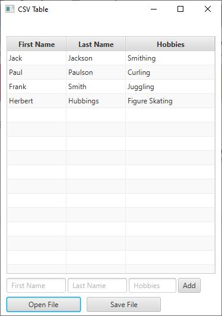

# CSVGUI #
Simple demo app for adding, saving and loading people's first names, last names, and hobbies to csv files.

JavaFX was used for the GUI and opencsv for loading and saving the data.

Created as part of a Java course.

### Features ###

* Add someone's name and hobbies.
* Save your collection to a csv file.
* Load a list from a csv file.
* Edit someone's details by clicking on the field you want to change.

## Screenshots ##

Picture of the application.

